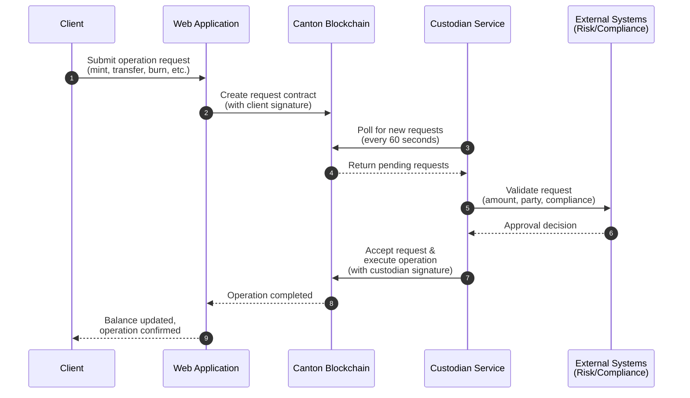

# Custodian Service Guide

## Overview

The Custodian Service automates the approval and processing of tokenized collateral operations on the Canton Network. It enables your organization to efficiently manage digital assets while maintaining control, compliance, and oversight.

## What is the Custodian Service?

Think of the Custodian Service as an intelligent automation layer between your users and the blockchain. It continuously monitors for incoming requests and automatically processes approvals according to your organization's policies.

### The Business Challenge

Traditional custodian operations require manual review and approval of every transaction:
- ❌ Time-consuming manual processes
- ❌ Operational bottlenecks during peak periods
- ❌ Increased risk of human error
- ❌ Limited operating hours

### The Solution

The Custodian Service automates these workflows:
- ✅ 24/7 automated monitoring and processing
- ✅ Instant approval of compliant transactions
- ✅ Consistent policy enforcement
- ✅ Complete audit trail
- ✅ Integration with your existing systems

## How It Works

### Simple Four-Step Process

**1. User Request**
Your clients submit requests through your web application—whether it's minting new tokens, transferring collateral, or processing bond coupons.

**2. Automatic Detection**
The service monitors the blockchain and immediately detects new requests requiring your approval as custodian.

**3. Policy Validation**
The service validates each request against your organization's approval policies and connects to your external systems (risk management, compliance, etc.) for verification.

**4. Automatic Execution**
Once validated, the service automatically approves and executes the operation on the blockchain. Your clients see results in real-time.

### Example Scenario: Collateral Transfer

```
9:00 AM - Client requests to transfer $1M in tokenized bonds
9:00 AM - Service detects request on blockchain
9:01 AM - Service checks compliance and risk systems
9:01 AM - Request approved, transfer executed
9:01 AM - Client sees updated balance
```

Without automation, this same process might take hours or even days with manual review.

### Custodian Workflow Diagram



**Key Points:**
- **Automated Detection**: Service continuously monitors the blockchain without manual intervention
- **External Integration**: Connects to your existing risk and compliance systems for validation
- **Multi-Party Security**: Requires both client and custodian signatures for operations
- **Real-Time Updates**: Clients see results immediately after approval

## What Operations Can Be Automated?

### Token Collateral Operations

**Minting (Token Creation)**
- **Use Case**: Client deposits cash and receives tokenized collateral
- **Business Value**: Instant collateral availability, reduced settlement risk
- **Example**: Hedge fund posts $10M margin requirement via tokenized treasury bills

**Transfers (Ownership Changes)**
- **Use Case**: Moving collateral between accounts or counterparties
- **Business Value**: Real-time rebalancing, margin call automation
- **Example**: Automatically reallocate collateral during intraday margin calls

**Burning (Token Retirement)**
- **Use Case**: Client withdraws collateral, tokens are retired
- **Business Value**: Immediate settlement, reduced operational risk
- **Example**: Close positions and return collateral to client's cash account

### Bond Operations

**Bond Issuance**
- **Use Case**: Primary market issuance of tokenized bonds
- **Business Value**: Faster time-to-market, reduced issuance costs
- **Example**: Issue $100M corporate bond series with instant allocation

**Bond Transfers**
- **Use Case**: Secondary market trading, portfolio rebalancing
- **Business Value**: T+0 settlement, reduced counterparty risk
- **Example**: Client sells $5M bond position with immediate settlement

**Lifecycle Events**
- **Use Case**: Coupon payments, maturity redemptions
- **Business Value**: Automated income distribution, no missed payments
- **Example**: Quarterly coupon payment to 1,000 bondholders simultaneously

## Key Benefits

### ⚡ Operational Efficiency

**Reduce Manual Work**
- Eliminate repetitive approval tasks
- Free up staff for high-value activities
- Scale operations without adding headcount

**Faster Processing**
- Near-instant approval for standard requests
- 24/7 availability
- No operational delays or backlogs

### 🔒 Risk Management

**Consistent Policy Enforcement**
- Rules applied uniformly to all transactions
- No exceptions without explicit authorization
- Reduced operational risk

**Enhanced Controls**
- Integration with existing risk systems
- Real-time compliance checking
- Automated limit monitoring

### 📊 Transparency & Audit

**Complete Visibility**
- Every request logged and tracked
- Clear audit trail for regulators
- Real-time monitoring dashboards

**Regulatory Compliance**
- Maintain records of all approvals
- Demonstrate consistent policy application
- Support regulatory reporting requirements

### 💰 Cost Savings

**Lower Operating Costs**
- Reduce manual processing expenses
- Minimize settlement failures
- Decrease error-related losses

**Improved Client Experience**
- Faster service delivery
- Reduced friction in operations
- Enhanced competitiveness

## Configuration & Policies

### Setting Your Approval Rules

The service can be configured to match your organization's risk appetite and compliance requirements:

**Amount-Based Rules**
- Auto-approve transactions under specified thresholds
- Escalate large transactions for manual review
- Apply different limits by asset class or client type

**Party Whitelists**
- Pre-approve transactions with known, trusted counterparties
- Automatic KYC/AML verification
- Blocklist screening

**Time-Based Rules**
- Restrict operations to business hours if required
- Apply different rules for regular vs. off-hours transactions
- Holiday and weekend handling

**Multi-Level Approval**
- Route high-risk transactions to senior approvers
- Escalation workflows for exceptions
- Maker-checker controls where needed

### Integration with Your Systems

The service connects with your existing infrastructure:

**Risk Management Platforms**
- Real-time limit checking
- Concentration risk monitoring
- Counterparty exposure tracking

**Compliance Systems**
- Sanctions screening
- Transaction monitoring
- Regulatory reporting

**Treasury & Operations**
- Collateral availability verification
- Cash account integration
- Settlement instruction generation

## Monitoring & Oversight

### What You Can See

**Real-Time Activity Dashboard**
- Current request queue and processing status
- Volume metrics by operation type
- Processing time statistics
- Exception and error tracking

**Audit Reports**
- Complete transaction history
- Approval decision records
- Policy violation alerts
- Regulatory reports

**Performance Metrics**
- Request volumes and trends
- Approval rates by category
- Processing time analytics
- System health indicators

### Oversight Controls

**Management Reporting**
- Daily/weekly/monthly activity summaries
- Exception reports for management review
- Trend analysis and capacity planning
- Risk exposure reporting

**Alert Configuration**
- Unusual activity notifications
- Threshold breach alerts
- System error notifications
- Compliance violation warnings

## Security & Compliance

### How Your Assets Are Protected

**Cryptographic Security**
- Industry-standard encryption for all communications
- Secure key management
- Digital signatures for transaction authentication

**Access Controls**
- Restricted access to authorized personnel only
- Multi-factor authentication
- Regular access reviews and audits

**Audit Trail**
- Immutable blockchain record
- Complete transaction history
- Tamper-proof logging

### Regulatory Considerations

**Compliance Framework**
- Supports regulatory recordkeeping requirements
- Maintains audit trail for examinations
- Enables regulatory reporting

**Risk Management**
- Consistent with custody best practices
- Supports existing risk management frameworks
- Enhances control environment

## Getting Started

### Implementation Overview

Your organization's technical team will work with our support to:

1. **Connect** the service to your Canton Network environment
2. **Configure** your approval policies and system integrations
3. **Test** with sample transactions in a safe environment
4. **Deploy** to production with monitoring and support
5. **Optimize** based on real-world usage patterns

### Timeline

- **Week 1-2**: Initial setup and configuration
- **Week 3-4**: Testing and policy refinement
- **Week 5**: Production deployment
- **Ongoing**: Monitoring, optimization, and enhancement

### Success Factors

**Start Simple**
- Begin with basic auto-approval rules
- Gradually add complexity as confidence builds
- Monitor closely during initial period

**Integrate Gradually**
- Connect to one external system at a time
- Validate each integration thoroughly
- Expand based on business priorities

**Monitor & Adjust**
- Review activity logs regularly
- Refine rules based on experience
- Gather feedback from operations staff

## Use Case Examples

### Investment Fund Manager

**Challenge**: Manual processing of daily margin calls across 50+ counterparties created operational bottlenecks.

**Solution**: Automated collateral transfers using the Custodian Service with pre-approved counterparty list.

**Results**:
- Reduced margin call response time from 4 hours to 5 minutes
- Eliminated missed deadlines and fees
- Freed up operations team for client service

### Corporate Treasury

**Challenge**: Bond coupon payments to thousands of holders required significant manual effort quarterly.

**Solution**: Automated bond lifecycle processing with the Custodian Service.

**Results**:
- Reduced processing time from 3 days to 30 minutes
- Eliminated payment errors
- Improved bondholder satisfaction

### Broker-Dealer

**Challenge**: Collateral movements for client trades required manual approval, causing settlement delays.

**Solution**: Automated token transfers with amount-based approval thresholds.

**Results**:
- Achieved T+0 settlement for 95% of trades
- Reduced operational costs by 60%
- Improved competitive positioning

## Support & Resources

### Need Help?

Your technical team can access detailed documentation in the accompanying technical guides. For business questions or strategic guidance, contact your relationship manager.

### Best Practices

**Implementation**
- Involve operations, risk, and compliance teams early
- Start with limited scope and expand gradually
- Document your approval policies clearly

**Operations**
- Review activity logs regularly
- Monitor exception rates and trends
- Maintain communication with technical team

**Governance**
- Establish clear escalation procedures
- Review and update policies periodically
- Maintain management oversight and reporting

### Future Capabilities

We're continuously enhancing the service with new features:

**Coming Soon**
- Advanced analytics and reporting dashboards
- Machine learning-based fraud detection
- Enhanced multi-custodian coordination
- Additional asset class support

**On the Roadmap**
- Visual workflow designer for approval rules
- Mobile monitoring applications
- API for third-party integrations
- Advanced compliance reporting tools

## Quick Reference

### Supported Operations

| Asset Type | Operation | Typical Use Case |
|------------|-----------|------------------|
| Tokens | Mint | Collateral deposit |
| Tokens | Transfer | Margin call, rebalancing |
| Tokens | Burn | Collateral withdrawal |
| Bonds | Issue | Primary market placement |
| Bonds | Transfer | Secondary trading |
| Bonds | Lifecycle | Coupon payment, redemption |

### When to Use Automation

✅ **Good Candidates for Automation**
- High-volume, routine transactions
- Well-defined approval criteria
- Time-sensitive operations
- Transactions with pre-approved counterparties

⚠️ **Consider Manual Review**
- First-time counterparties
- Unusually large transactions
- Non-standard requests
- Regulatory-sensitive operations

---

## Conclusion

The Custodian Service transforms tokenized collateral operations from a manual, time-consuming process into an efficient, automated workflow. By maintaining your control and oversight while eliminating operational bottlenecks, it enables you to deliver faster, more reliable service to your clients while reducing costs and risks.

**Ready to get started?** Contact your technical team to begin the implementation process.

---

*For technical implementation details, see the accompanying technical documentation (CLAUDE.md and README.md).*
